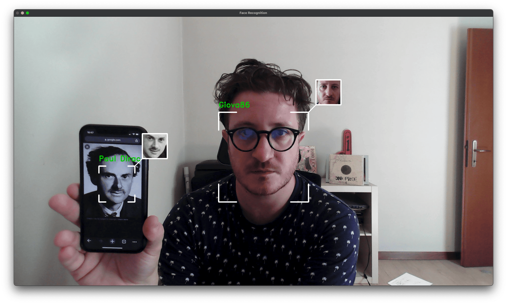
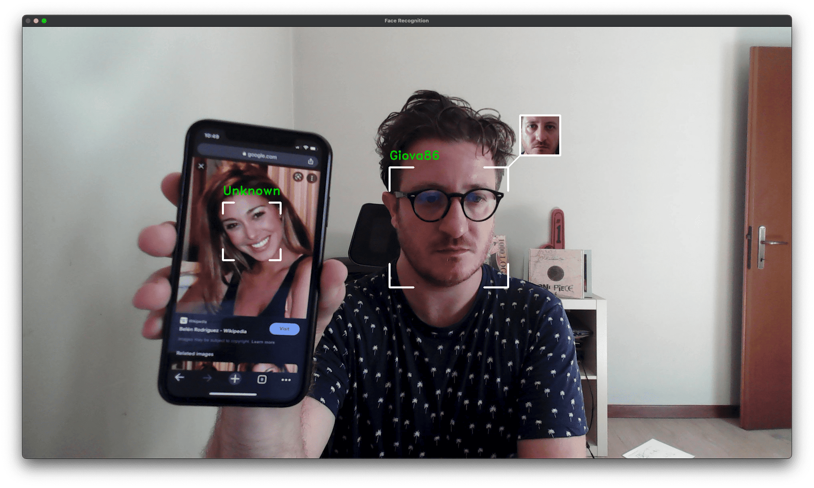

# Face Recognition

Build your personal face detection and face recognition algorithm. 

<br>
<p align="center">
  
</p>  
<br>
<br>
<p align="center">
  
  
  
</p>  
<br>

## Python Version

This code i tested to work with Pytohn 3.9.

## Environment

```
python3.9 -m venv venv
source venv/bin/activate
pip install -r requirements.txt
```

## How to

- Database creation

In order to prepare your personal database put your images (in jpg format) inside the `known_people` folder. Each picture must contain no more than one face and the file name has to be reflect the person represented. File name will be use as label.

- Run

```
python app.py
```

- Optional arguments

...

## Bibliography

- https://www.youtube.com/watch?v=535acCxjHCI

- https://www.youtube.com/watch?v=d2QIw6cQg40

- https://www.youtube.com/watch?v=5yPeKQzCPdI


