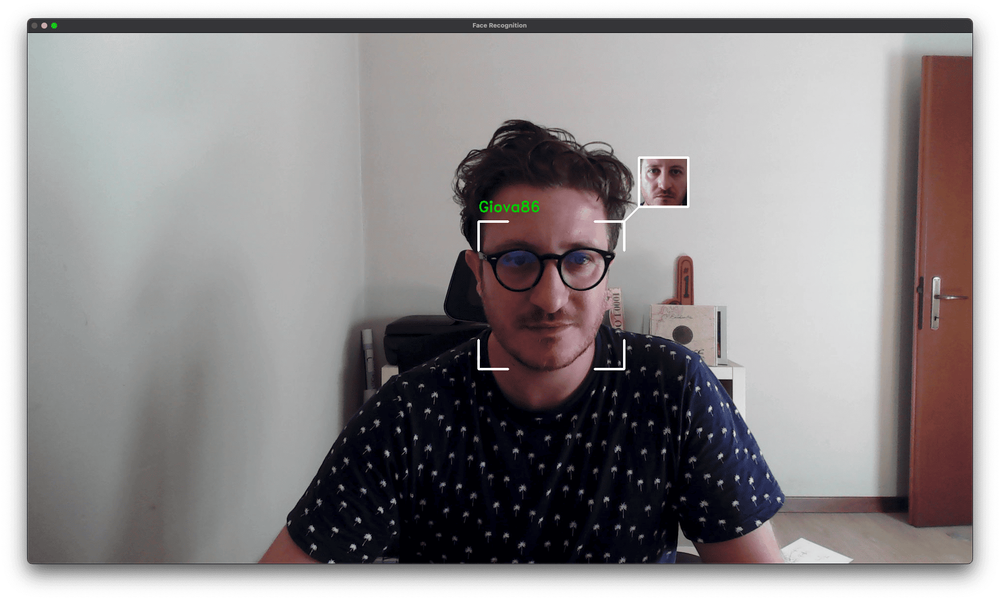

# Face Recognition

A real-time face recognition system that detects faces from camera input, identifies known individuals, and displays their information alongside their avatar.

<br>
<p align="center">
  
</p>  
<br>
<br>
<p align="center">
  
  
  
</p>  
<br>

## Python Version

This code i tested to work with Pytohn 3.10.

## Environment

```
python3.10 -m venv venv
source venv/bin/activate
pip install -r requirements.txt
```

## Setup
### Known People Directory
Place images of people you want to recognize in the `known_people` directory.

* You can add multiple images of the same person using the naming format: `name.jpg`, `name_1.jpg`, `name_2.jpg`, etc.
* The system will automatically extract the person's name from the filename.

### Avatar Images
The system will automatically create avatar images in the `known_avatar` directory based on the first image of each person.

Additionally, create an `Unknown.jpg` file in the known_avatar directory to display as the default avatar for unrecognized faces.

## Usage
Run the application:
```bash
python app.py
```
### Command-line Arguments

* `-c`, `--camera_id`: ID of the camera to use (default: 0)
* `-k`, `--known`: Folder containing known people images (default: "known_people")
* `-r`, `--rescale`: Scaling factor for processing (default: 0.25)
* `-a`, `--avatar_dimension`: Avatar height in pixels (default: 100)
* `-f`, `--force_update`: Force model update even if no new people are detected

Example:
```bash
python app.py --camera_id 1 --rescale 0.5 --avatar_dimension 150
```

### How It Works

1. Database Check: The system checks for new faces in the `known_people` directory
2. Avatar Creation: Creates avatar images for any new people detected
3. Model Training: Updates the recognition model if new faces are found
4. Face Detection: Captures video from the camera and detects faces in real-time
5. Recognition: Compares detected faces against the known database
6. Display: Shows avatars and information for recognized individuals

### Avatar Positioning
The system intelligently positions avatars around the detected face:

* It checks if there's enough space to display the avatar at the top, bottom, left, or right
* It draws a connecting line between the face and the avatar
* It displays the person's name and social information next to the avatar

### Controls

Press `q` to quit the application

### Customization
You can customize various aspects of the system by modifying constants at the top of the script:
```python
thickness = 2                # Line thickness
color = (0, 0, 0)            # Line color (BGR)
avatar_w_dimension = 100     # Avatar width
tolerance = 5                # Positioning tolerance
distance = 30                # Distance between face and avatar
frame_border = 0.2           # Face frame border (0 to 1)
```

### Notes
* The system automatically detects changes in the `known_people` directory and updates the model as needed
* For best results, use clear, well-lit images of faces
* Multiple images of the same person can improve recognition accuracy
* Make sure your camera is properly connected and accessible

### Troubleshooting
* If faces aren't being recognized, try adjusting the scaling factor (`--rescale`)
* If avatars aren't displaying, check that the avatar files exist in the `known_avatar` directory
* For performance issues, try using a lower resolution or smaller avatar size

## Bibliography

- https://www.youtube.com/watch?v=535acCxjHCI

- https://www.youtube.com/watch?v=d2QIw6cQg40

- https://www.youtube.com/watch?v=5yPeKQzCPdI


